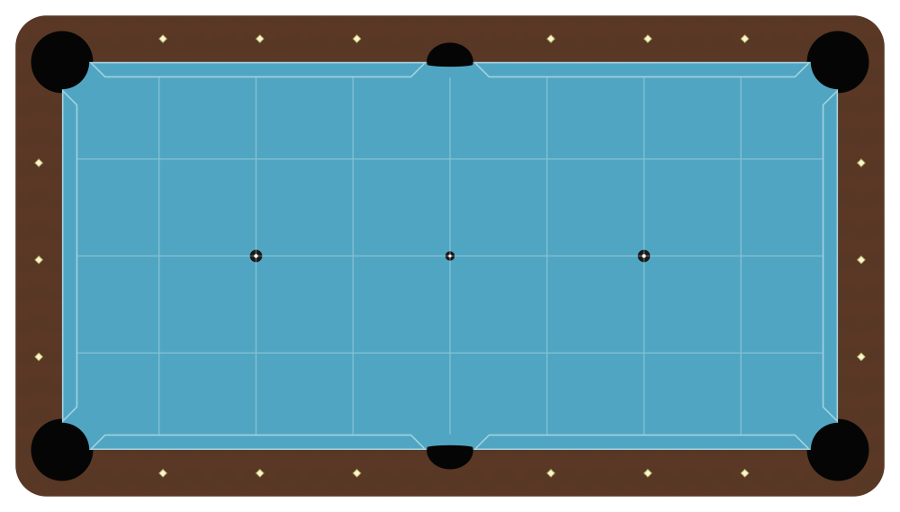

# ACE Shot Diagrams

An interactive pool/billiards shot diagramming tool with physics-based shot solving, position play aids, and multiple game mode support.



## Quick Start

1. Open `index.html` in any modern browser
2. Drag balls from the palette onto the table
3. Click a pocket to select target
4. Double-click or long-press a ball to select it as the object ball
5. Adjust english (spin) and power in the Cue Control palette
6. View shot analysis in the Shot Info panel

No build step, dependencies, or server required - it's a single HTML file.

## Features

- **Drag-and-drop ball placement** with real-time shot calculation
- **Multiple shot types**: Direct, Kick (1-rail, 2-rail), Bank, Combination
- **5 game modes**: 9-Ball, 8-Ball, 10-Ball, Straight Pool, One Pocket
- **Position aids**: Tangent line, follow/draw lines, shape zone visualization
- **Shot analysis**: Cut angle, make probability, difficulty rating
- **Export**: PNG (1600x900), SVG (800x450), shareable URL links
- **Save/Load**: Named diagrams stored in browser localStorage
- **Guided tour**: First-time user walkthrough

---

## Technical Architecture

### Overview

ACE Shot Diagrams is a **zero-dependency, single-file web application**. All HTML, CSS, and JavaScript are contained in `index.html` (~7600 lines). This design prioritizes:

- **Portability**: Works offline, can be hosted anywhere
- **Simplicity**: No build tools, no framework overhead
- **Performance**: Instant load, no network requests

### File Structure

```
ace-shot-diagrams/
├── index.html              # Main application (all-in-one)
├── pool-table-template.svg # Reference SVG template
├── pool-table-labeled.svg  # Labeled version for documentation
├── versions/               # SVG version history (v001-v009)
├── claude.md               # Developer documentation
├── FEATURE_ROADMAP.md      # Planned features & anti-features
├── GAME_MODE_PLAN.md       # Game mode implementation details
└── preview.png             # Screenshot for README
```

### Application Structure (index.html)

```
┌─────────────────────────────────────────────────────────────────┐
│  <style> CSS (~750 lines)                                       │
│  ├── Layout & responsive design                                 │
│  ├── Glassmorphism floating palettes                            │
│  ├── Ball styling (solids/stripes)                              │
│  ├── Shot visualization (paths, indicators)                     │
│  └── Tour overlay system                                        │
├─────────────────────────────────────────────────────────────────┤
│  <body> HTML (~250 lines)                                       │
│  ├── SVG pool table (embedded, 14 layers)                       │
│  ├── Floating tool palettes (5 panels)                          │
│  └── Tour overlay elements                                      │
├─────────────────────────────────────────────────────────────────┤
│  <script> JavaScript (~4500 lines)                              │
│  ├── Constants & Configuration                                  │
│  ├── Vector Math Utilities                                      │
│  ├── Physics Engine (kick paths, energy transfer)               │
│  ├── Shot Solver (direct, kick, bank, combo)                    │
│  ├── Game Mode System                                           │
│  ├── UI Controllers (drag, palettes, pockets)                   │
│  ├── Position Aids (tangent, follow, draw, shape zone)          │
│  ├── State Encoding (URL sharing)                               │
│  ├── Export Functions (PNG, SVG)                                │
│  ├── Local Storage (save/load diagrams)                         │
│  ├── Tour System                                                │
│  └── Test Suite                                                 │
└─────────────────────────────────────────────────────────────────┘
```

### SVG Layer Architecture

The pool table SVG uses 14 organized layers:

| Layer | ID | Purpose |
|-------|-----|---------|
| 1 | `layer-outer-frame` | Dark brown table edge |
| 2 | `layer-rails` | Wood grain pattern rails |
| 3 | `layer-pocket-voids` | Dark pocket holes |
| 4 | `layer-slate-cloth` | Tournament blue playing surface |
| 5 | `layer-cushions` | Rubber cushions with highlight |
| 6 | `layer-diamonds` | Rail sights (mother-of-pearl) |
| 7 | `layer-strings` | Reference lines (hidden) |
| 8 | `layer-spots` | Head, center, foot spots |
| 9 | `layer-grid` | Diamond-aligned grid (hidden) |
| 10 | `layer-triangle` | Rack outline (hidden) |
| 11 | `layer-balls-object` | Object balls (1-15) |
| 12 | `layer-ball-cue` | Cue ball |
| 13 | `layer-shot-paths` | Shot lines/arrows |
| 14 | `layer-annotations` | Labels/notes |

### Coordinate System

- **Table dimensions**: 100 × 50 SVG units (9ft × 4.5ft)
- **viewBox**: `-8 -8 116 66` (includes 8-unit rail margin)
- **Scale**: 1 SVG unit = 1 inch
- **Ball diameter**: 2.25 units
- **Ghost ball offset**: 2.25 units (two ball radii for contact point)

### Core Data Structures

```javascript
// Ball positions (SVG coordinates)
ballPositions = {
  'cue': { x: 25, y: 25 },
  'ghost': { x: 75, y: 25 },
  '1': { x: 75, y: 25 },
  // ... balls 2-15
};

// Game mode configuration
GAME_MODES = {
  NINE_BALL: {
    id: '9ball',
    name: '9-Ball',
    targetRule: 'rotation',      // must hit lowest first
    ballIds: ['1','2',...'9'],
    comboMustHitLowestFirst: true
  },
  // ... other modes
};

// Shot data object (computed each frame)
shotData = {
  cutAngle: 35.5,
  distance: 42.3,
  difficulty: 'medium',
  isReady: true,
  isKickShot: false,
  isBankShot: false,
  isComboShot: false
};
```

### Physics Engine

The physics system handles:

1. **Path Finding**: Direct, 1-rail kick, 2-rail kick, bank shots
2. **Collision Detection**: Ball-ball and ball-rail interactions
3. **Energy Transfer**: `cos²(θ)` transfer based on cut angle
4. **Friction Model**: Exponential decay with configurable coefficient
5. **Rail Bounce**: Coefficient of restitution (0.88 default)

Key physics constants:
```javascript
BALL_RADIUS = 1.125;           // Half of 2.25" diameter
ROLLING_FRICTION_DECAY = 0.008; // Speed loss per unit
RAIL_COR = 0.88;               // Rail bounce coefficient
MAX_ENGLISH_ANGLE = 15;        // Max spin deflection (degrees)
```

### Shot Solver Algorithm

```
1. Check direct path (cue → ghost → object ball → pocket)
   └─ If clear: use direct shot

2. If blocked, try kick shots:
   a. Score all 4 rails as potential 1-rail kicks
   b. For each rail:
      ├─ Calculate reflection point
      ├─ Check for blocking balls
      ├─ Compute cut angle at arrival
      └─ Score based on: difficulty + energy + scratch risk
   c. Try 2-rail combinations if 1-rail blocked
   d. Select highest-scoring viable path

3. Check for bank shot opportunity:
   └─ Object ball bounces off rail to pocket

4. Check for combination shot:
   └─ Hit helper ball into object ball into pocket
```

### State Encoding (URL Sharing)

Diagram state is encoded in the URL hash for instant sharing:

```
#v1|cue:25.5,32.1|1:60,25|p:cbr|b:1|m:9ball|f:6|e:0.0,0.0|s:auto
 │   │            │       │     │   │       │   │         └─ solver mode
 │   │            │       │     │   │       │   └─ english (x,y)
 │   │            │       │     │   │       └─ force (1-10)
 │   │            │       │     │   └─ game mode
 │   │            │       │     └─ selected ball
 │   │            │       └─ pocket (corner-bottom-right)
 │   │            └─ ball 1 position
 │   └─ cue ball position
 └─ version prefix
```

### UI Component Architecture

**Floating Palettes** (glassmorphism design):

| Palette | Position | Purpose |
|---------|----------|---------|
| `#palette-balls` | Top-left | Ball rack for dragging |
| `#palette-cue` | Bottom-left | English selector + power slider |
| `#palette-game` | Top-right | Game mode + solver selection |
| `#palette-shot` | Bottom-right | Shot info display |
| `#palette-share` | Top-right area | Export + position aids |

All palettes are:
- Draggable via header
- Minimizable (collapse to title bar)
- Semi-transparent with backdrop blur

### Event Flow

```
User drags ball
    │
    ▼
mousedown → track draggedBall, offset
    │
    ▼
mousemove → update ball position (pageToSvg conversion)
    │
    ▼
updateCueGhostLine() → find kick/direct path
    │
    ▼
updateShotGeometry() → calculate angles, distances
    │
    ▼
updateShotInstructions() → refresh Shot Info panel
    │
    ▼
updateTangentLine() → position aids
updateFollowDrawLines()
updateShapeZone()
    │
    ▼
updateURLState() → encode to URL hash
```

---

## Development Guide

### Running Tests

Open browser console and run:
```javascript
ACETests.runAll()
```

Tests cover:
- Vector math utilities
- Path blocking detection
- State encoding/decoding
- Make probability calculation
- Game mode rules
- UI element existence

### Key Functions Reference

| Function | Purpose |
|----------|---------|
| `updateShotGeometry()` | Main calculation loop |
| `findKickPath()` | Kick shot path finding |
| `scoreKickPath()` | Rate kick shot viability |
| `isPathBlockedByAnyBall()` | Collision detection |
| `calculateMakeProbability()` | Shot success % |
| `encodeState()` / `decodeState()` | URL serialization |
| `exportPNG()` / `exportSVG()` | Image export |
| `saveDiagram()` / `loadDiagram()` | localStorage ops |

### Adding a New Feature

1. **Position aids**: Add to `layer-shot-paths` SVG group, create update function
2. **Shot types**: Extend `findKickPath()` or create parallel finder
3. **Game modes**: Add to `GAME_MODES` object, update `isLegalTarget()`
4. **UI controls**: Add to appropriate palette, wire up event listeners

### Code Style Notes

- No semicolons (ASI-safe patterns)
- `const`/`let` only (no `var`)
- Descriptive function names (verb + noun)
- SVG manipulation via `setAttribute()` not direct property access
- Comments for physics formulas and non-obvious logic

### Common Gotchas

1. **Pocket elements use `data-pocket` attribute**, not `id`
2. **Cut angle must be calculated per-rail** inside kick loop (not before)
3. **Shot info panel requires all shotData properties** for both original and palette displays
4. **Dark backgrounds (#1a1a2e)** require light text (#9ab minimum for accessibility)

---

## Browser Support

- Chrome 80+
- Firefox 75+
- Safari 13.1+
- Edge 80+

Requires: ES6, SVG 1.1, CSS backdrop-filter, localStorage

---

## License

MIT License - See LICENSE file

---

## Contributing

1. Read `claude.md` for detailed technical documentation
2. Check `FEATURE_ROADMAP.md` for planned features and explicit anti-features
3. Run test suite before submitting changes
4. Keep changes focused - avoid scope creep

## Credits

Created with assistance from Claude (Anthropic)
